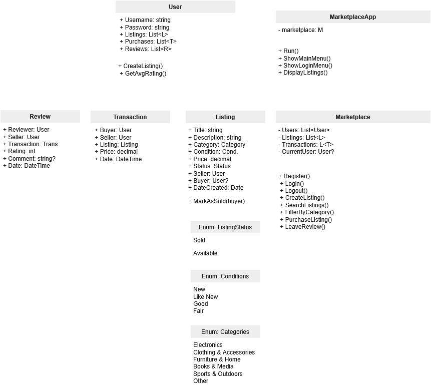

# Second-Hand Marketplace

A console-based marketplace application where users can buy and sell items.

## Features

- User registration and authentication
- Create and browse item listings
- Search and filter by category
- Purchase items from other users
- Leave reviews with terningkast (1-6 rating)
- View purchase history and reviews

## How to Run

1. Open the solution in Visual Studio or Rider
2. Build the project
3. Run the application
4. Follow the on-screen menu prompts

## Class Diagram

## Design Decisions

### Class Structure

**User, Listing, Transaction, Review** - Core data classes representing marketplace entities

**Marketplace** - Central business logic class that manages all users, listings, and transactions. Handles validation and coordinates actions between objects.

**MarketplaceApp** - UI layer that handles all console interaction, separated from business logic for clean architecture.

### OOP Concepts Used

- **Encapsulation**: Private fields with public properties, validation in constructors
- **Composition**: User HAS listings, transactions, and reviews rather than inheritance
- **Separation of Concerns**: Business logic (Marketplace) separated from UI (MarketplaceApp)

At the beginning of this project I structured this project out in UML and tried to find usecases where inheritance would
fit in. I used a lot of time on that and decided that instead of forcing it in I left it out. 

### C# Features

- **Generic Collections**: List<User>, List<Listing>, List<Transaction>, List<Review>
- **LINQ**: Used for filtering, searching, and calculating averages
- **Enums**: Category, Condition, ListingStatus for type safety
- **Exception Handling**: Try-catch blocks in UI, validation in business logic

## AI Usage

This project was developed with assistance from Claude (Anthropic AI assistant). AI was used for:

- Learning OOP concepts and LINQ syntax
- Debugging logic errors
- Code structure guidance
- Understanding best practices
- This Readme file

Almost all code was written by myself. AI was used to provide explanations and give hints rather than direct solutions. 
I would like to address that for the final commits regarding MarketPlaceApp 
I have been copy pasting code because I was starting to run out of time and needed that functionality in order to get testing possible.
I will upload another file where you can read through our conversation.

## Git Commit History

Regular commits were made throughout development.
https://github.com/alekssaasen/Arbeidskrav2